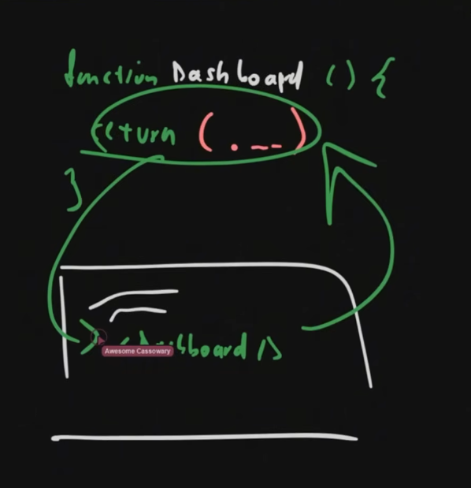

# REACT Course - [Gentleman Programming](https://www.youtube.com/watch?v=GMnWXlJnbNo)

## ¿Cuándo usar React vs un framework?

React surge como una alternativa al CSR (Client Side Rendering) tradicional, o tambien llamada SPA, que tiene problemas de SEO y tiempos de carga lentos. React permite construir interfaces de usuario de manera más eficiente y dinámica, mejorando la experiencia del usuario.

React es una librería de JavaScript par generar aplicaciones basadas en componentes reutilizables. A diferencia de los frameworks completos como Angular o Vue, React se enfoca principalmente en la capa de vista (UI) y deja otras responsabilidades, como el manejo del estado y las rutas, a bibliotecas adicionales.

React es un conjunto de librerías, por eso, conviene usarlo para proyectos que requieran:

- Aplicaciones a la medida
  - Dado que podemos elegir las librerías que mejor se adapten a nuestras necesidades, podemos crear aplicaciones altamente personalizadas.
- Simplicidad
- Minimiza el peso
  - A diferencia de frameworks más pesados, React permite construir aplicaciones ligeras y rápidas.
- Prototipado rápido
  - Permite crear prototipos de interfaces de usuario rápidamente, facilitando la iteración y el feedback.
- SPA
  - React es ideal para aplicaciones de una sola página, donde la experiencia del usuario es fluida y rápida. CSR, el browser renderiza la aplicación en el cliente, lo que mejora la velocidad de carga y la interactividad.
  - Privacidad, ya que no necesitamos que el proyecto esté disponible al público.

### Frameworks de React

- **SolidJS**: Un framework minimalista que se enfoca en la simplicidad y la eficiencia, ideal para proyectos pequeños y medianos.
  - Reactividad Real (signals)
  - Contra: No hay trabajo.
- **Next.js**: Un framework completo que ofrece renderizado del lado del servidor (SSR), generación de sitios estáticos (SSG) y muchas otras características listas para usar, ideal para aplicaciones más grandes y complejas.
  - Necesito SEO?
  - Necesito todo lo que brinda?
  - Contra: Tiene su forma de pensar diferente, sus soluciones son solo SSR y SSG.
- **Remix**: Un framework que se centra en la experiencia del desarrollador y la optimización del rendimiento, ideal para aplicaciones web modernas.
  - Neceisito SEO?
  - Performance?
  - Data Fetching?
  - Routing?
  - Comodo?
  - Contra: No hay trabajo.

## Setup proyecto - Configuración profesional desde día uno

Al ejecutar el comando `bun run build` se generará una carpeta `dist` con el código listo para producción, y una carpeta `src` con el código fuente.
Este arroja un index.html que es el punto de entrada de la aplicación e importa los archivos de JavaScript generados llamados bundle, un bundle es un pedazo de código, este código es el resultado de un bundler.
Un bundler consta de 3 procesos para generar el bundle:

1. **Minificación**: Elimina espacios en blanco, comentarios y otros caracteres innecesarios para reducir el tamaño
2. **Uglifying**: Renombra variables y funciones para hacer el código más difícil de leer, lo que también ayuda a reducir el tamaño del archivo.
3. **Tree Shaking**: Elimina el código no utilizado, lo que reduce aún más el tamaño del archivo.

Es una buena práctica tener una estructura de carpetas publica y privada, donde la carpeta publica siempre se envía al cliente (cuando no tenga privilegios de acceso) y la carpeta privada solo se envía al cliente cuando tiene privilegios de acceso. Esto mejorará la seguridad y el rendimiento de la aplicación.

React usa los ESModules (EcmaScript Modules) , que es un sistema de módulos nativo de JavaScript que permite importar y exportar código entre archivos. Esto facilita la organización y reutilización del código a comparación de Vue, que usa un sistema de módulos propio y más complejo.

EcmaScript es un estándar de JavaScript que define cómo debe funcionar el lenguaje. Un organismo de estandarización llamado TC39 es el encargado de definir y actualizar este estándar. Cada año, TC39 lanza una nueva versión de EcmaScript con nuevas características y mejoras.

### Estructura de la aplicación

- vite.config.ts:
  - Vite es un bundler moderno que utiliza ESModules y ofrece una experiencia de desarrollo rápida y eficiente. Vite utiliza Rollup como bundler para la construcción de producción, lo que garantiza un código optimizado y eficiente. Además de que agrega plugins para mejorar la experiencia de desarrollo, estos se pueden ver en el archivo `vite.config.ts`.
    Si quisieramos usar un plugin como PWA, testing, etc, solo tendríamos que agregar el plugin en el archivo de configuración.
- tsconfig.json:
  - En `tsconfig.json` tenemos configuraciones importantes para controlar la manera en como trabajamos y con el equipo de desarrollo en conjunto.
- main.tsx:
  - ¿Por qué en mi archivo main.tsx uso StrictMode?
    StrictMode controla la manera en como funcionan los componentes, esto lo hace creando un componente, montarlo, desmontarlo y volverlo a montar, y verificará si el estado del componente se mantiene igual a antes de desmontarlo, si no es así, nos avisará que algo anda mal.
    CreateRoot crea la raíz de la aplicación, y es el punto de entrada de la aplicación. Obtiene el elemento con id "root" del index.html y monta la aplicación en ese elemento, en este caso, el componente App.
- App.tsx:
  - Este componente App es el componente principal de la aplicación, y es el que contiene todos los demás componentes. Se exporta y se importa en el main.tsx.
    Los componentes que se exportan generalmente se hacen con export default, esto permite que se importe el componente sin necesidad de usar llaves y se puede importar con cualquier nombre.

El resultado de main.tsx es generar una SPA

## Detección de cambios

React al usar SPA, necesita un index.html donde indentifica el punto de entrada de la aplicación, y carga el código JavaScript generado por el bundler. Para esto necesitamos un mecanismo que detecte los cambios en el código y los aplique automáticamente en el navegador, esto se logra con un trigger. Un trigger es un evento el cual va a iniciar un proceso de render, por ejemplo, un botón, un cambio de estado, una llamada a una API.
Tenemos dos tipos de triggers:

- **Inicial**: Cuando la aplicación se carga por primera vez, React monta el componente raíz en el DOM.
- **Re-render**: Cuando hay un cambio en el estado o las propiedades de un componente, React vuelve a renderizar ese componente y sus hijos.

React utiliza un DOM y un Virtual DOM. El DOM (Document Object Model) es la representación del documento HTML en el navegador y el Virtual DOM que es una representación en memoria del DOM real. Cuando hay un cambio en el estado o las propiedades de un componente, se active un trigger, y React actualiza el Virtual DOM, luego compara este con el DOM real para aplicar solo los cambios necesarios (aplica un render). Un render es ejecutar una función que devuelve un elemento React.

Un componente es una función que va a ser ejecutada y su resultado se renderiza.

Nuestro trabajo es tratar de minimizar los renders, porque este proceso puede ser costoso en términos de rendimiento.



¿Qué es un commit en React?

El commit es el proceso de aplicar los cambios del Virtual DOM al DOM real. Cuando React detecta un cambio en el estado o las propiedades de un componente, actualiza el Virtual DOM y luego realiza un commit para aplicar esos cambios al DOM real.

## Componentes

Un componente es una función que se encarga de renderizar una parte de la interfaz de usuario. Devuelve un elemento JSX, JSX es una sintaxis que permite escribir HTML dentro de JavaScript, y es transformado por Babel en llamadas a funciones de React.

Un componente debe ser una unidad mínima de lógica posible.

La sintaxis JSX admite interpolación de JavaScript, lo que significa que podemos insertar variables y expresiones dentro del JSX utilizando llaves `{}`. Esto permite crear componentes dinámicos y reutilizables.
La mejor manera de aplicar CSS es a través de los módulos CSS, que permiten importar archivos CSS y aplicarlos a los componentes de manera modular. Esto evita conflictos de estilos y mejora la mantenibilidad del código.

Es importante tener en cuenta que los componentes deben ser lo más simples y detectar qué lógica le corresponde al padre y qué lógica le corresponde al hijo, y si un componente tiene demasiada lógica, es mejor dividirlo en componentes más pequeños.

Una buena práctica es tener una carpeta `components` donde se almacenen todos los componentes de la aplicación, y dentro de esta carpeta, tener una carpeta por cada componente, y dentro de cada carpeta, tener un archivo `.ts` y su respectivo archivo `.css`. Además, es recomendable tener un archivo `index.ts` dentro de la carpeta `components` que exporte todos los componentes, para facilitar su importación en otros archivos. A esto se le llama barrel file.

Existen dos tipos de componentes en React:

- **Componente tonto**: Es un componente que no tiene estado y solo se encarga de renderizar la interfaz de usuario. Se define como una función que recibe props y devuelve un elemento JSX.
- **Componente inteligente**: Es un componente que tiene estado y lógica de negocio. Se define como una clase que extiende de `React.Component` o como una función que utiliza hooks para manejar el estado y los efectos secundarios.

El estado es el lugar donde se almacenan las variables, los métodos y las funciones que se utilizan en un componente, es información que se va a utilizar en varios componentes o rerenders y que condiciona el renderizado de la interfaz de usuario.

## UseState

El hook `useState` es una función que permite agregar estado a los componentes funcionales. Se importa desde el paquete `react` y se utiliza dentro de un componente para declarar una variable de estado y una función para actualizarla.
El hook `useState` bindea una variable a un estado, y cada vez que se actualiza el estado, el componente se vuelve a renderizar, además de la función que actualiza el estado, la cual genera un trigger para que React sepa que debe volver a renderizar el componente.

### Batching

React agrupa múltiples actualizaciones de estado en un solo render para mejorar el rendimiento. Esto significa que si se llaman varias veces a la función de actualización del estado dentro de un mismo evento, React solo realizará un render al final del evento, en lugar de uno por cada llamada a la función de actualización del estado.
Esto es especialmente útil en eventos como clics de botones o envíos de formularios, donde se pueden realizar múltiples actualizaciones de estado en respuesta a una sola acción del usuario.

## UseEffect
El hook `useEffect` es una función que nos va a ayudar a manejar los ciclos de vida de los componentes funcionales. Es un método que ejecuta una función y tiene un array de dependencias, y cada vez que una de las dependencias cambia, se ejecuta la función.

Se utiliza para comunicarnos con entidades externas al componente, como APIs, operaciones asíncronas, parametros de enrtada, etc. También se pueden usar múltiples `useEffect` en un mismo componente para manejar diferentes efectos secundarios.

En un custom hook siempre se debe usar `useEffect` para manejar los renderizados y los efectos secundarios.

## Custom Hooks

Los custom hooks son funciones que permiten reutilizar lógica de estado y efectos secundarios en diferentes componentes. Se definen como funciones que comienzan con la palabra "use" y pueden utilizar otros hooks dentro de ellas.

## Notas extras

### Problemas en la instalación (Bun)

TypeScript no encuentra los tipos de JSX, y eso normalmente pasa cuando:

- No tienes instalados los tipos de React (@types/react y @types/react-dom).
- Tu tsconfig.json no está configurado para JSX (por ejemplo, falta "jsx": "react-jsx" o "react").

En tu error se ve claramente:

Esta etiqueta JSX requiere que exista la ruta de acceso del módulo "react/jsx-runtime"...
El elemento JSX tiene el tipo "any" implícitamente porque no existe ninguna interfaz "JSX.IntrinsicElements".

Solución:
Solución paso a paso

1. Instalar los tipos necesarios

Con Bun, ejecuta:

```bash
bun add -d @types/react @types/react-dom
```

(el -d es porque son dependencias de desarrollo)

1. Configurar tsconfig.json

Abre tu tsconfig.json y asegúrate de que tenga algo así:

```json
{
  "compilerOptions": {
    "target": "ESNext",
    "lib": ["DOM", "DOM.Iterable", "ESNext"],
    "module": "ESNext",
    "moduleResolution": "Node",
    "jsx": "react-jsx",
    "esModuleInterop": true,
    "allowJs": true,
    "skipLibCheck": true,
    "strict": true
  },
  "include": ["src"],
  "exclude": ["node_modules"]
}
```

Clave: la opción "jsx": "react-jsx" le dice a TS que use la nueva transformación JSX de React 17+.
